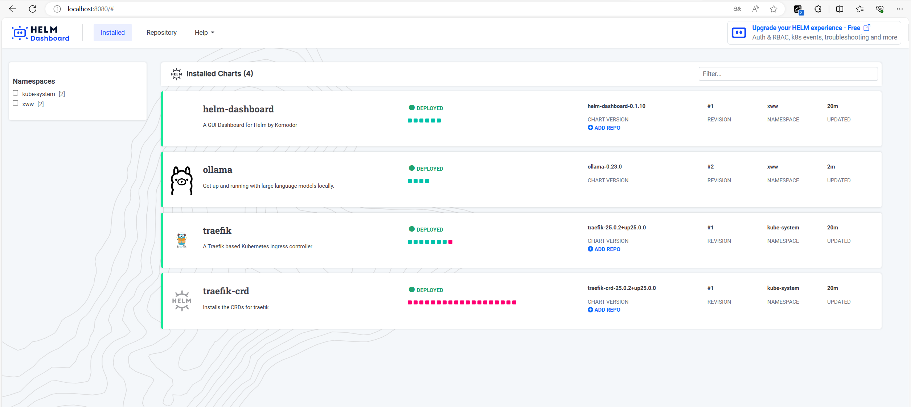
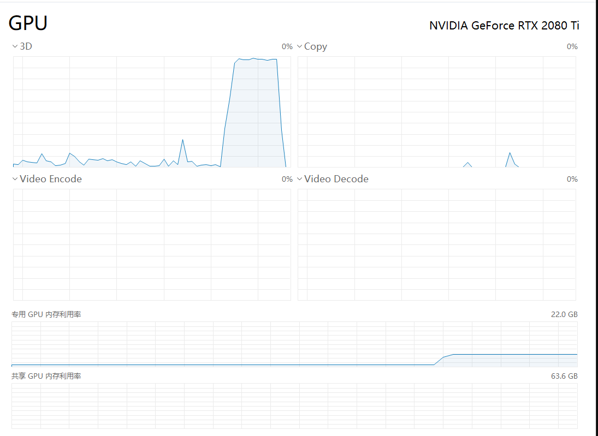

# LLM On K3S

开箱即用的 `K3D` 配置，可以快速启动支持 `GPU` 的 `K3s` 环境，用以运行 `CUDA` 负载！

默认启动一个 `ollama` 环境

# 目标

- [x] 支持 `WSL2`

- [x] 支持可视化管理应用，默认会启动一个 `helm-dashboard` （http://localhost:8080/#）

# 截图

Helm-Dashboard


通过 `ollama` 运行 `llama2`


`GPU` 占用


# 开始使用

安装 [k3d](https://k3d.io/v5.6.3/)

启动集群

```
k3d cluster create -c .\config\k3d-config.yml
```

`helm` 安装过程中会访问 `github` 拉取 `charts` ，如果安装失败，一般是网络问题.

查看显卡是否正常识别

```
kubectl get pods -A
NAMESPACE     NAME                                      READY   STATUS      RESTARTS         AGE
kube-system   nvidia-device-plugin-daemonset-rc-wzlnr   1/1     Running     0                44m
kube-system   local-path-provisioner-6c86858495-xckfs   1/1     Running     0                44m
kube-system   metrics-server-54fd9b65b-m446f            1/1     Running     0                44m
kube-system   coredns-6799fbcd5-hjdkk                   1/1     Running     0                44m
kube-system   helm-install-traefik-crd-znp45            0/1     Completed   0                44m
kube-system   helm-install-helm-dashboard-p9gdp         0/1     Completed   0                44m
kube-system   helm-install-traefik-vr6wq                0/1     Completed   1                44m
kube-system   svclb-traefik-e85d254b-2wljc              2/2     Running     0                43m
kube-system   traefik-f4564c4f4-gnlkm                   1/1     Running     0                43m
xww           helm-dashboard-7f9c7c795b-sm8v5           1/1     Running     0                43m
xww           ollama-58db7b89f6-b989b                   1/1     Running     0                25m
kube-system   helm-install-ollama-vr7vz                 0/1     Error       10 (5m10s ago)   26m
```

查看 `nvidia-device-plugin-daemonset` 日志，查看显卡是否正常加载

```
 kubectl logs nvidia-device-plugin-daemonset-rc-wzlnr -n kube-system
I0417 13:40:48.973369       1 main.go:178] Starting FS watcher.
I0417 13:40:48.973443       1 main.go:185] Starting OS watcher.
I0417 13:40:48.973837       1 main.go:200] Starting Plugins.
I0417 13:40:48.973857       1 main.go:257] Loading configuration.
I0417 13:40:48.974695       1 main.go:265] Updating config with default resource matching patterns.
I0417 13:40:48.974810       1 main.go:276]
Running with config:
{
  "version": "v1",
  "flags": {
    "migStrategy": "none",
    "failOnInitError": true,
    "mpsRoot": "/run/nvidia/mps",
    "nvidiaDriverRoot": "/",
    "gdsEnabled": false,
    "mofedEnabled": false,
    "useNodeFeatureAPI": null,
    "plugin": {
      "passDeviceSpecs": true,
      "deviceListStrategy": [
        "envvar"
      ],
      "deviceIDStrategy": "uuid",
      "cdiAnnotationPrefix": "cdi.k8s.io/",
      "nvidiaCTKPath": "/usr/bin/nvidia-ctk",
      "containerDriverRoot": "/driver-root"
    }
  },
  "resources": {
    "gpus": [
      {
        "pattern": "*",
        "name": "nvidia.com/gpu"
      }
    ]
  },
  "sharing": {
    "timeSlicing": {}
  }
}
I0417 13:40:48.974829       1 main.go:279] Retrieving plugins.
I0417 13:40:48.976044       1 factory.go:104] Detected NVML platform: found NVML library
I0417 13:40:48.976078       1 factory.go:104] Detected non-Tegra platform: /sys/devices/soc0/family file not found
I0417 13:40:48.993449       1 server.go:216] Starting GRPC server for 'nvidia.com/gpu'
I0417 13:40:48.993952       1 server.go:147] Starting to serve 'nvidia.com/gpu' on /var/lib/kubelet/device-plugins/nvidia-gpu.sock
I0417 13:40:48.995586       1 server.go:154] Registered device plugin for 'nvidia.com/gpu' with Kubelet
```

运行 `CUDA` 工作负载，验证是否能正常调用显卡

```
kubectl apply -f .\test\cuda-vector-add.yaml
pod/cuda-vector-add created
```

```
kubectl get pods
NAME              READY   STATUS      RESTARTS   AGE
cuda-vector-add   0/1     Completed   0          5m26s
```

```
kubectl logs cuda-vector-add
[Vector addition of 50000 elements]
Copy input data from the host memory to the CUDA device
CUDA kernel launch with 196 blocks of 256 threads
Copy output data from the CUDA device to the host memory
Test PASSED
Done
```

以上都正常的话，就可以运行真正的 `CUDA` 负载了

默认会启动一个 `ollama` 的程序

进入 `ollama` 启动一个模型

```
kubectl get pods -n xww
NAME                              READY   STATUS    RESTARTS   AGE
helm-dashboard-7f9c7c795b-sm8v5   1/1     Running   0          41m
ollama-58db7b89f6-b989b           1/1     Running   0          23m
```

```
kubectl -n xww exec -it ollama-58db7b89f6-b989b -- bash
```

```
root@ollama-58db7b89f6-b989b:/# nvidia-smi
Wed Apr 17 14:03:59 2024
+-----------------------------------------------------------------------------------------+
| NVIDIA-SMI 550.73.01              Driver Version: 552.12         CUDA Version: 12.4     |
|-----------------------------------------+------------------------+----------------------+
| GPU  Name                 Persistence-M | Bus-Id          Disp.A | Volatile Uncorr. ECC |
| Fan  Temp   Perf          Pwr:Usage/Cap |           Memory-Usage | GPU-Util  Compute M. |
|                                         |                        |               MIG M. |
|=========================================+========================+======================|
|   0  NVIDIA GeForce RTX 2080 Ti     On  |   00000000:01:00.0 Off |                  N/A |
| 31%   27C    P8             16W /  250W |    1293MiB /  22528MiB |     13%      Default |
|                                         |                        |                  N/A |
+-----------------------------------------+------------------------+----------------------+

+-----------------------------------------------------------------------------------------+
| Processes:                                                                              |
|  GPU   GI   CI        PID   Type   Process name                              GPU Memory |
|        ID   ID                                                               Usage      |
|=========================================================================================|
|  No running processes found                                                             |
+-----------------------------------------------------------------------------------------+
```

```
root@ollama-58db7b89f6-b989b:/# ollama list
NAME    ID      SIZE    MODIFIED
root@ollama-58db7b89f6-b989b:/# ollama run llama2
pulling manifest
pulling 8934d96d3f08... 100% ▕███████████████████████████████████████████████████████████████████████████████▏ 3.8 GB
pulling 8c17c2ebb0ea... 100% ▕███████████████████████████████████████████████████████████████████████████████▏ 7.0 KB
pulling 7c23fb36d801... 100% ▕███████████████████████████████████████████████████████████████████████████████▏ 4.8 KB
pulling 2e0493f67d0c... 100% ▕███████████████████████████████████████████████████████████████████████████████▏   59 B
pulling fa304d675061... 100% ▕███████████████████████████████████████████████████████████████████████████████▏   91 B
pulling 42ba7f8a01dd... 100% ▕███████████████████████████████████████████████████████████████████████████████▏  557 B
verifying sha256 digest
writing manifest
removing any unused layers
success
>>> Send a message (/? for help)

>>> 请使用中文介绍一下自己，不低于1000字
Title: 我的名字是小明，我来自中国

我的名字是小明，我来自中国。我的国家有丰富的历史和文化遗产，包括中国古代文明、唐宋等时期的艺术作品、中国菜系和中国音乐等。我的人民也有着unique的文化和习惯，例如中国年式的春节、中秋月 festival等。

我的个人特点包括：

* 我是一名小学生，10岁了。
* 我喜欢玩骑自行车，感受自然之美。
* 我也喜欢唱歌， particulary Chinese traditional songs and folk music.
* 我的家乡位于中国南部，气候非常好。
* 我的父母是一对优秀的教育者，在教育领域也有些成就。
* 我的兄弟姐妹也很好，每个人都具有不同的特点和兴趣。

我的感情生活包括：

* 我喜欢与家人和朋友分享时间，聊天、玩GAMES together.
* 我也喜欢看电影和听音乐，以获得心情的释放和刺激。
* 在学业方面，我非常重视学习和自学，努力跟keep up with my classmates.
* 在社交圈中，我喜欢与他人分享和讨论有 интерес的话题，例如文化、思想和生活方式。

我的长处包括：

* 我善于表达自己的意见和情感，能够透明地表达自己的想法和感受。
* 我具有丰富的想象力和创造力，经常可以为自己和他人设计新的GAMES和活动。
* 我也非常重视课程和学习，能够积极地完成任务和提高知识水平。
* 在社交圈中，我能够善于与他人分享和讨论有兴趣的话题，并建立良好的沟通关系。

希望这可以为你提供一个更加深入的了解我。如果你还有任何问题或需要更多信息，请随时问问。

>>> Send a message (/? for help)
```

# 删除集群

```
k3d cluster delete gpu-test
```
# 致谢

- [k3d](https://github.com/k3d-io/k3d)

- [k3s](https://github.com/k3s-io/k3s/)

- [ollama](https://github.com/ollama/ollama)

- [k3d-gpu-support](https://github.com/qingfengfenga/k3d-gpu-support)

- [k8s-device-plugin](https://github.com/NVIDIA/k8s-device-plugin)